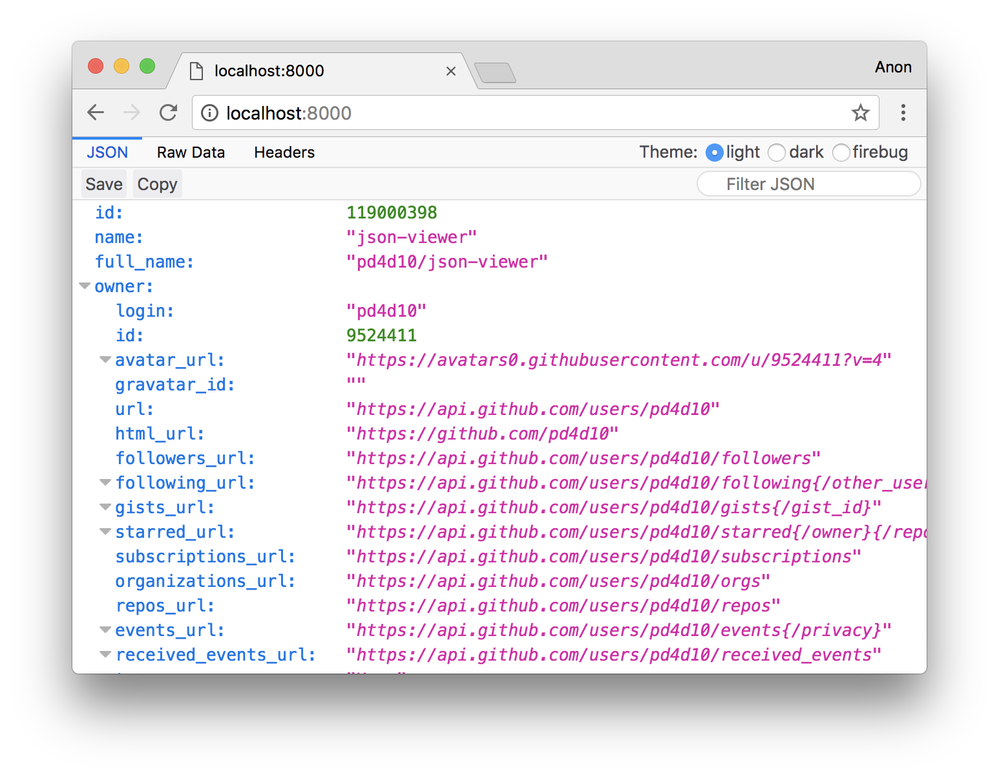

# JSON Viewer

Port of [Firefox's JSON Viewer](https://developer.mozilla.org/en-US/docs/Tools/JSON_viewer) for Chrome and Opera

## Installation

Install it from [Chrome Web Store](https://chrome.google.com/webstore/detail/json-viewer/efknglbfhoddmmfabeihlemgekhhnabb)

Opera users could use this extension: [Install Chrome Extensions](https://addons.opera.com/en/extensions/details/download-chrome-extension-9/)

## Usage

Try https://httpbin.org/headers after installation

Open *Allow access to file URLs* to make `file:///` work

## License

MIT
